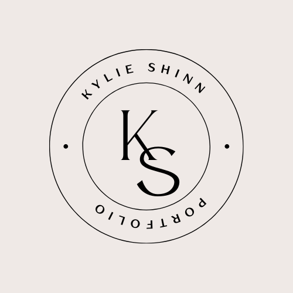

# professional-portfolio

https://kyliemshinn.github.io/professional-portfolio/

## Description

This project is meant to showcase all the relevant work experience I have thus far with web development. I chose my strongest projects that show the progression in web development I have made at this point. The theme of this project was meant to be simple and modern, with a minimalistic feel- a style that expresses me and my style in general. I chose black and white for its simplicity and modern feel. I created my own logo through canvas that I have made my own home page logo. 

## Features

* Biography and logo statement about me
* Relevant projects
* Contact information

## Technologies Used

* HTML
* CSS 

## Author

Kylie Shinn

* Github: https://github.com/kyliemshinn
* LinkedIn: https://www.linkedin.com/in/kylie-shinn-18b0301b7/

## License

MIT License

Copyright (c) [2022] [Kylie]

Permission is hereby granted, free of charge, to any person obtaining a copy of this software and associated documentation files (the "Software"), to deal in the Software without restriction, including without limitation the rights to use, copy, modify, merge, publish, distribute, sublicense, and/or sell copies of the Software, and to permit persons to whom the Software is furnished to do so, subject to the following conditions:

The above copyright notice and this permission notice shall be included in all copies or substantial portions of the Software.

THE SOFTWARE IS PROVIDED "AS IS", WITHOUT WARRANTY OF ANY KIND, EXPRESS OR IMPLIED, INCLUDING BUT NOT LIMITED TO THE WARRANTIES OF MERCHANTABILITY, FITNESS FOR A PARTICULAR PURPOSE AND NONINFRINGEMENT. IN NO EVENT SHALL THE AUTHORS OR COPYRIGHT HOLDERS BE LIABLE FOR ANY CLAIM, DAMAGES OR OTHER LIABILITY, WHETHER IN AN ACTION OF CONTRACT, TORT OR OTHERWISE, ARISING FROM, OUT OF OR IN CONNECTION WITH THE SOFTWARE OR THE USE OR OTHER DEALINGS IN THE SOFTWARE.